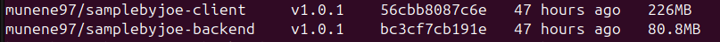
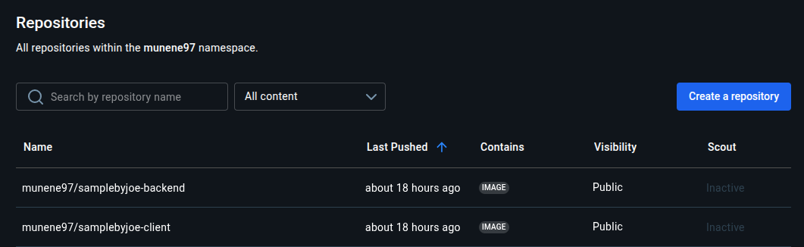
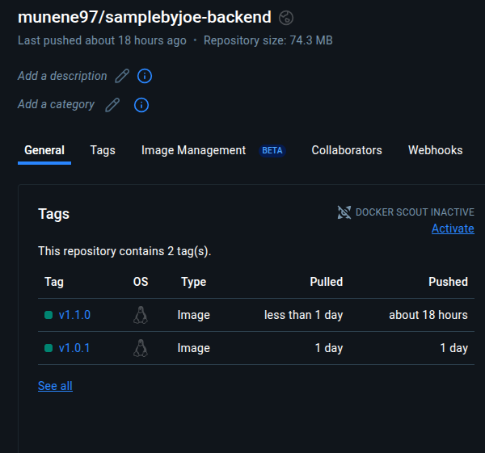
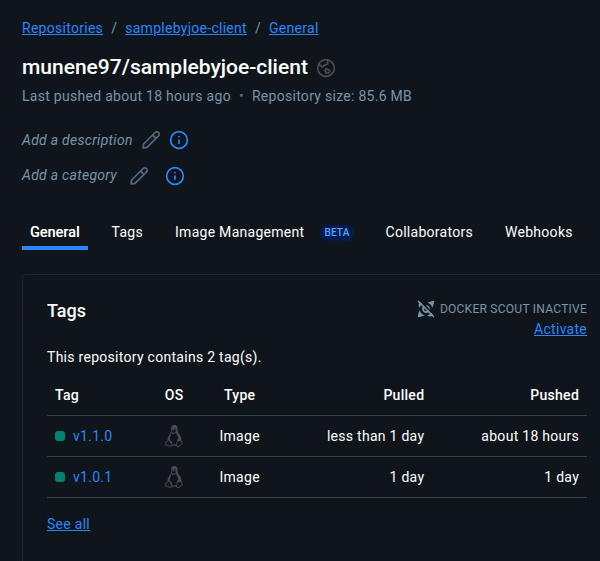
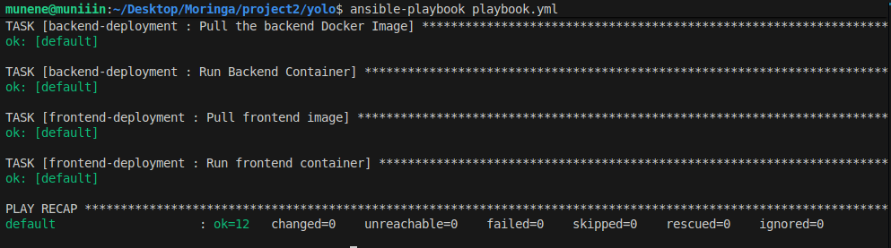
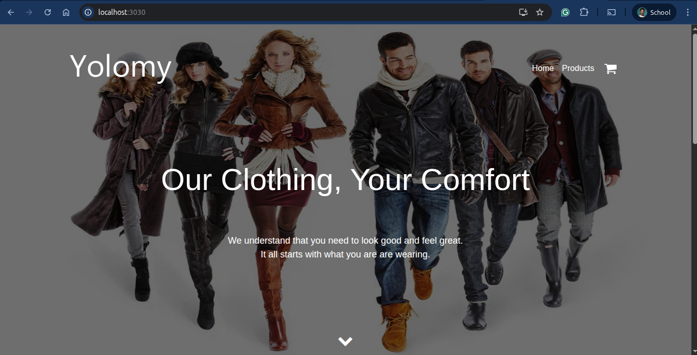

# 🧠 SampleByJoe

> *Personalised from the original Brian-YOLO build — restructured, optimised, and debugged for clarity, speed, and smaller Docker images.*

---

## 🚀 Project Overview

This project started as a fork of **Brian-YOLO**, and I gradually transformed it into **SampleByJoe** — a cleaner, more understandable, and better-performing version.

The goal was to **simplify configurations**, **reduce Docker image size**, and **streamline how the app parses and serves data** through the client and backend.

Everything was renamed for clarity and easier debugging. Below is a breakdown of what changed, why it changed, and how it improved the app.

---

## ⚙️ General Modifications

- Renamed all instances of `brian-yolo` → `samplebyjoe` for clarity.
- Removed redundant comments to better follow the app execution.
- Updated the **image name** in both the Docker YAML and backend files.
- Adjusted the **Docker subnet** (conflicts with my local hotspot subnet).
- Renamed the **Docker volume** for easier tracking and debugging.
- Commented out the **Docker Compose version declaration** (was triggering warnings).
- Updated port mapping from `3000:80` to align with **NGINX** serving the frontend build.

---

## 🐋 Docker Optimisation (Reducing Image Size)

The main bottleneck was image size and redundant build layers. Here’s how I trimmed it down and improved performance.

### 🔧 Key Changes

1. **Switched `npm install` → `npm ci`**
   - Uses the `package-lock.json` for deterministic installs.
   - Wipes `node_modules` before installation for clean, repeatable builds.
   - ⚠️ Breaks if `package.json` and `package-lock.json` are out of sync.

2. **Used `node:18-alpine`**
   - Lightweight, officially maintained, and already includes Node + npm.
   - Smaller footprint than full Node images.
   - Faster, more secure builds with fewer dependencies.

3. **Avoided using `alpine:3` directly**
   - Super light but too minimal — no Node, npm, or build tools.
   - `node:18-alpine` strikes the perfect balance between size and usability.

4. **Configured `package.json` in the client for backward compatibility**
   - Ensured React scripts stayed compatible with Node 18 and OpenSSL 3.

---

## 🧩 Client Dockerfile (Frontend)

### Removed redundant steps
- Removed:
  - `COPY ..` (caused duplicate files and extra layers)
  - `WORKDIR /app` (already defined)
  - `RUN apk update && apk add npm` (npm already included in Node base image)

### Added multi-stage build
- **Build stage:** Uses Node to build the React app.
- **Final stage:** Uses NGINX to serve static files.
- Added:
  ```dockerfile
  CMD ["nginx", "-g", "daemon off;"]










## 🚀 Deployment Automation Summary

To ensure a smooth deployment of the YOLO app, several adjustments were made to the **Ansible playbook** and **roles** configuration.

### 🧠 Playbook Refinement
The main playbook was updated to:
- Automate **Docker installation** and configuration within the Vagrant VM.
- Add Docker’s **GPG key and repository** to ensure compatibility with Ubuntu 20.04.
- Include a pre-task to **create a Docker network (`samplebyjoe-net`)** for all containers to communicate seamlessly.
- Ensure Docker services start automatically on boot.

### 🧩 Roles Directory Overhaul
Each role was refined to align with the Docker workflow:
- **setup-mongodb** → Configured the MongoDB container with a persistent volume and connected it to the shared Docker network.
- **backend-deployment** → Pulled the latest backend image and ran it on port 5000 with network linkage.
- **frontend-deployment** → Deployed the React + NGINX container serving the build files on port 3000.

All roles now depend on the same Docker bridge network, ensuring inter-container communication without exposing unnecessary ports.

### 🧱 Infrastructure Improvements
- Added a dedicated **Docker volume (`app-mongo-data`)** to maintain database persistence.
- Simplified role dependencies by letting Ansible handle sequencing automatically via the playbook.
- Ensured all Docker images pull from **Docker Hub** for consistent builds.

### ✅ End Result
The final setup creates an automated pipeline where:
1. Vagrant provisions a clean Ubuntu VM.  
2. Ansible installs and configures Docker.  
3. The three app services (MongoDB, Backend, Frontend) deploy automatically in isolated containers.  
4. Each service connects via the same Docker network for full app functionality.

This structure mirrors a real-world microservice environment, allowing effortless redeployment, scaling, and updates from a single playbook command.




### 🧩 Vagrant Port Forwarding Setup (Host ↔ VM Access)

To access the YOLO app running inside Vagrant (the backend, frontend, and MongoDB containers), we had to configure **port forwarding** in the `Vagrantfile`.  

By default, Vagrant maps the guest’s ports directly to your host — but since the host ( the pc hosting the VM) already had active listeners on ports **3000** and **5000**, the VM refused to boot.

**Fix:** I just remapped them to avoid conflicts and keep things tidy.

# Vagrantfile (network configuration section)
config.vm.network "forwarded_port", guest: 3000, host: 3030
config.vm.network "forwarded_port", guest: 5000, host: 5050



## 🔐 Kubernetes Secrets & Environment Configuration

To keep MongoDB credentials and sensitive data secure, store them as **Kubernetes Secrets** instead of hardcoding in YAML files.

### 1️⃣ Create a Secret for MongoDB URI
```bash
kubectl create secret generic mongo-secret \
  --from-literal=MONGO_URI="mongodb+srv://<username>:<password>@cluster.mongodb.net/darkroom" \
  -n yolo-app

## 🗂️ Kubernetes Configuration (k8s/ Folder)

This folder contains all Kubernetes manifests for deploying the YOLO App.

| File | Purpose |
|------|----------|
| `namespace.yaml` | Defines the isolated Kubernetes namespace `yolo-app`. |
| `mongo.yaml` | Deploys MongoDB as a **StatefulSet** with persistent storage |
| `yolo-backend.yaml` | Deploys the Node.js backend using Docker image `munene97 samplebyjoe-backend:v1.1.1`. Connects to MongoDB via `MONGO_URI`. |
| `yolo-frontend.yaml` | Deploys the React frontend, exposed externally |

### Workflow

